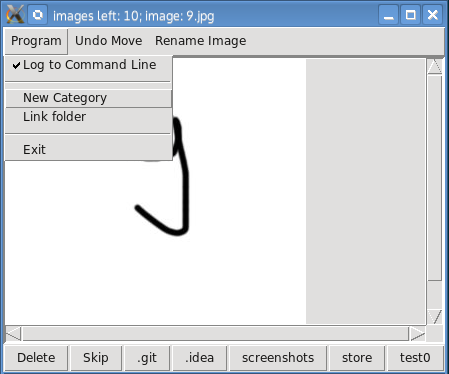

# Image Mover

Image mover is a small pyhton program that can be used to organize image collections.
Simply drop all the images you want to sort in one folder and create subfolders for the categories you want to sort into.
The program displays a window and you can click on buttons corresponding to the folders or skip and delete images also.

## Requirements

* Python (python 2.7 tested)
* Pillow (on most systems probably already installed, otherwise it should be something like `pip install pillow`)

## Usage

Starting from the command line: ``./imageMover [options] [path]``

* ``-h``, ``--help``: displays usage instructions
* ``-v``, ``--verbose``: display messages upon moving image handling
* ``--version``: displays the version number

The GUI has an option to toggle logging to the command line (which only makes sense, when you started the program from the command line of course).

* Main Window

* Rename Window

* New Category Window

* Link Window

